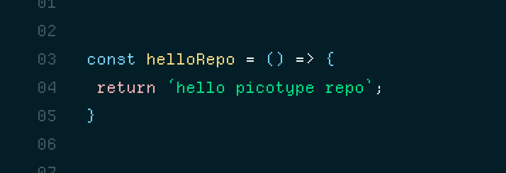
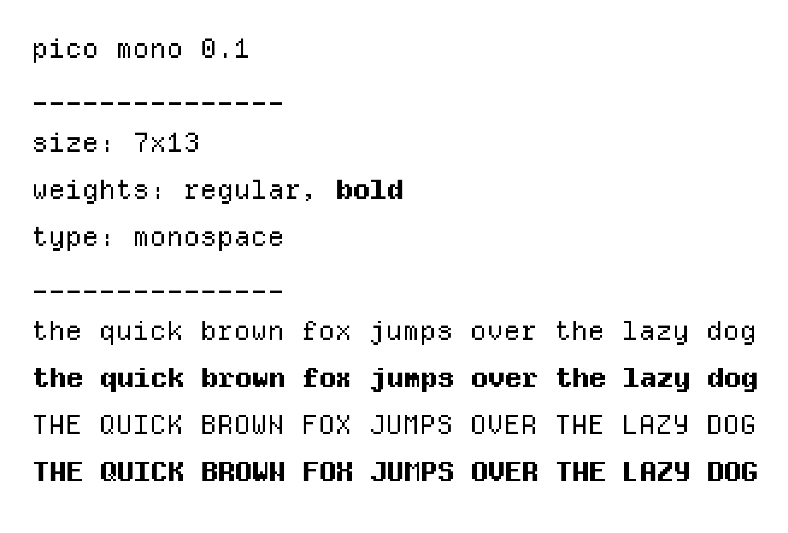
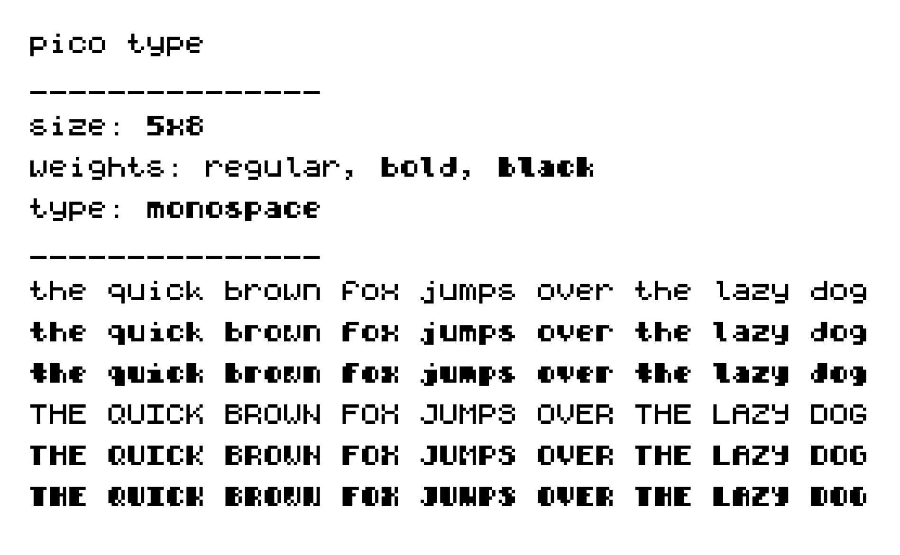
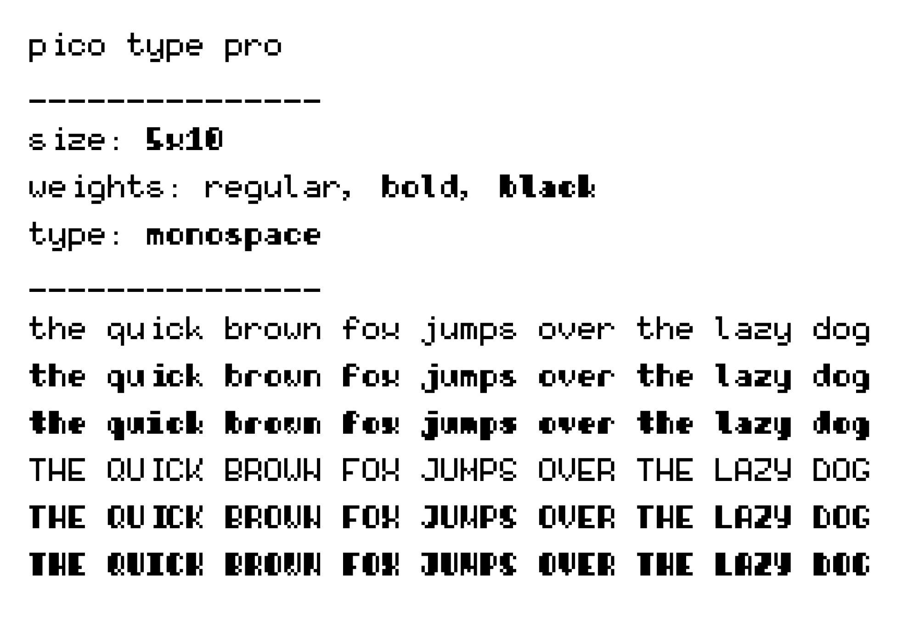
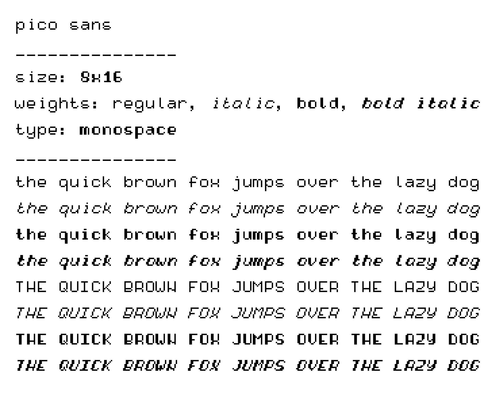

# `pico` fonts

## `picomono` typeface

13x7 pixel font. Minimal font that is still very usable for writing code.



## `picotype` typeface

8×5 pixel font with minimal width and height to not have ambiguities.



## `picotypepro` typeface

A 10×5 pixel font with a minimal legible width and height to to ensure consistent baseline for better legibility.



## `picosans` typeface

A 16×8 monospace sans serif pixel font with an italic version.



## Nerdfonts

All typefaces have a nerd font patched version. Patched with the complete icon set.

## Installation

### NPM Package

```bash
npm install picofonts
```

Then in your code:

```javascript
// Import all fonts
import "picofonts";

// Or import specific font
import "picofonts/picosans";
import "picofonts/picotype";
import "picofonts/picotypepro";
```

For React Native support:

```bash
npm install picofonts react-native expo-font
```

Then import from the react-native subpath:

```javascript
import {
  loadFonts,
  fonts,
  weights,
  styles,
  getFontName,
} from "picofonts/react-native";
```

### OS Installation

1. Download the font files from the latest [release](https://github.com/picocherry/picotype/releases), or from the [`/build`](https://github.com/picocherry/picotype/tree/main/build) directory
2. Install the fonts on your system:
   - **macOS**: Double-click the font files or use Font Book
   - **Linux**: Copy to `~/.local/share/fonts/` and run `fc-cache -f -v`
   - **Windows**: Right-click and select "Install"

# Contributing

Contributions are welcome! Please feel free to submit a Pull Request.

If you want to add a new font, you should add it to the ./src folder.
The ./src folder structure is the following:

```
📁 familyname/
├── 📁 regular/
│   └── familyname-regular.ttf
├── 📁 italic/
│   └── familyname-italic.ttf
├── 📁 bold/
│   └── familyname-bold.ttf
└── 📁 bolditalic/
    └── familyname-bolditalic.ttf
```

then run

`./build.sh`

script that will add metadata so that the OS knows all the different files are of the same font family.
build.sh will allow you to choose which font families you want to build, and the options you want to build them with. You will also be able to choose to patch with nerd fonts.

## Manual editing in FontForge

1. Install [FontForge](https://fontforge.org/en-US/downloads/mac/)
2. Open the font in FontForge
3. Element → Font Info...
4. General tab:

- Fontname: unique font name including the font family and the variant. E.g. Helvetica Regular
- Font Family: only the font family that needs to be the same on all fonts. E.g. Helvetica
- Name for Humans: just use same as font family

5. TTF Names tab:

- \<New\> → English (US) → Preferred Family → e.g. Helvetica
- \<New\> → English (US) → Preferred Styles → e.g. Regular
- if you changed the Fontname, update the UniqueID as well

6. File → Generate Fonts...

- check validate before saving
- use TrueType
- No BitMap Fonts
- Generate

## Patching to nerd fonts

Install python (`brew install python` on mac)

run `./generate`

This will generate the nerd fonts and put them in the `/build` directory.

### Manual patching command:

```
fontforge --script ./patcher/font-patcher --careful --mono --complete --simple ./picotype/picotype-regular.ttf
```

the `--simple` argument preservers the lowercase convention of all pico fonts so you don't need to use fontforge again
