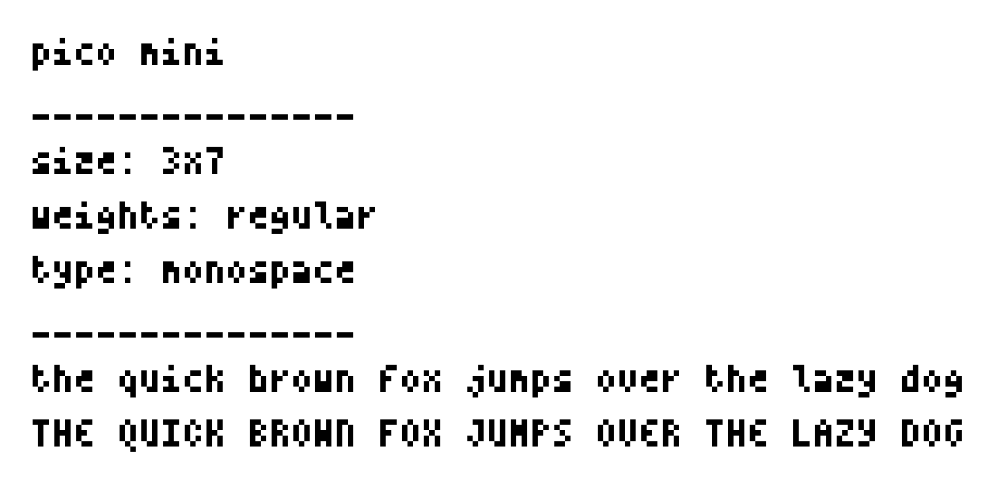
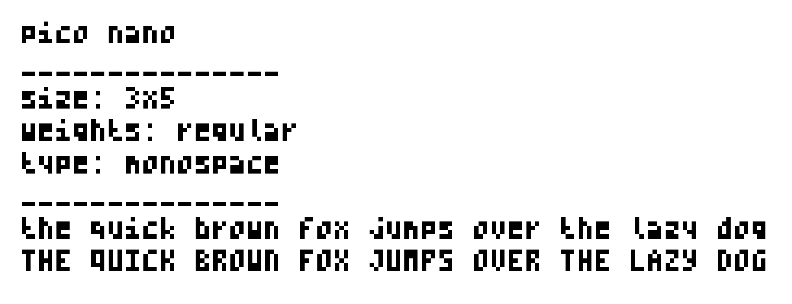
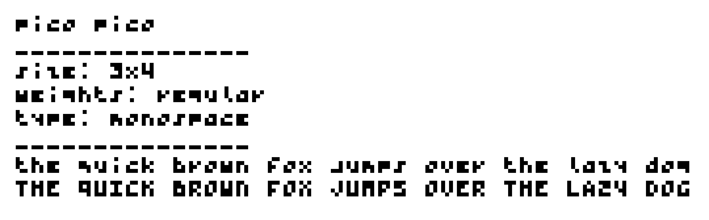
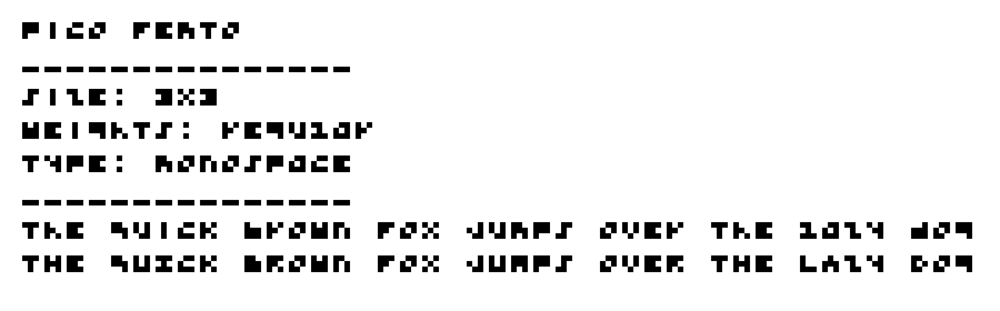

# `pico` fonts

A collection of pixel fonts for various purposes.

## `picomono` typeface

`7x13` pixel font: minimal font size that is still very usable for writing code.


## `picotype` typeface

`5x8` pixel font: minimal font size to not have ambiguities, and support multiple weights.


## `picotypepro` typeface

`5x10` pixel font: a minimal legible font size to to ensure consistent baseline for better legibility.


## `picosans` typeface

`8x16` monospace sans serif pixel font with an italic version.


## truly tiny fonts: `micro`, `nano`, `pico`, and `femto`

### `picomini` typeface

`3x7` pixel font: a minimal font size that is still legible for both upper and lower case letters, numbers, and all the ASCII symbols. No ambiguities.



### `piconano` typeface

`3x5` pixel font: a minimal font size that is still legible for upper and lower case letters, as well as numbers. Some other ASCII symbols are OK. No ambiguities.



### `picopico` typeface

`3x4` pixel font: a minimal font size that is still legible for upper and most of the lower case letters, as well as numbers. Very few other ASCII symbols look OK. No ambiguities.



### `picofemto` typeface

`3x3` pixel font: a minimal font size that is still somewhat legible for upper and some lower case letters and numbers, however it introduces some ambiguity (same glyphs for Z, z, and 2; T and t; 1 and l; Q and q; G and g; O and o, K and k, etc.).



## Nerdfonts

All typefaces have a nerd font patched version. Patched with the complete icon set.

### OS Installation

1. Download the font files from the latest [release](https://github.com/picocherry/picotype/releases), or from the [`/build`](https://github.com/picocherry/picotype/tree/main/build) directory
2. Install the fonts on your system:
   - **macOS**: Double-click the font files or use Font Book
   - **Linux**: Copy to `~/.local/share/fonts/` and run `fc-cache -f -v`
   - **Windows**: Right-click and select "Install"

# Contributing

Contributions are welcome! Please feel free to submit a Pull Request.

If you want to add a new font, you should add it to the ./src folder.
The ./src folder structure is the following:

```
📁 familyname/
├── 📁 regular/
│   └── familyname-regular.ttf
├── 📁 italic/
│   └── familyname-italic.ttf
├── 📁 bold/
│   └── familyname-bold.ttf
└── 📁 bolditalic/
    └── familyname-bolditalic.ttf
```

That is it! Once the PR is in, I will run the build script locally (CI will be added)

If you want to run the build youself you can optionally do so too:

To properly build the new font you will need:

- [FontForge](https://fontforge.org/en-US/downloads/mac/) with Python bindings (`brew install fontforge` on macOS, or `sudo apt-get install fontforge` on Linux)
- Python 3

Then run `./build.sh` — an interactive script that will:

1. Let you select which font families to build (space to toggle, `a` to select all)
2. Configure metadata options (naming, font type, version bump, line height)
3. Optionally add OpenType features (small caps, old-style figures)
4. Optionally patch with Nerd Fonts icons

The script adds proper metadata so that the OS recognizes all the different files as belonging to the same font family.

## Manual editing in FontForge

1. Install [FontForge](https://fontforge.org/en-US/downloads/mac/)
2. Open the font in FontForge
3. Element → Font Info...
4. General tab:

- Fontname: unique font name including the font family and the variant. E.g. Helvetica Regular
- Font Family: only the font family that needs to be the same on all fonts. E.g. Helvetica
- Name for Humans: just use same as font family

5. TTF Names tab:

- \<New\> → English (US) → Preferred Family → e.g. Helvetica
- \<New\> → English (US) → Preferred Styles → e.g. Regular
- if you changed the Fontname, update the UniqueID as well

6. File → Generate Fonts...

- check validate before saving
- use TrueType
- No BitMap Fonts
- Generate

## Patching to nerd fonts

Install python (`brew install python` on mac)

run `./generate`

This will generate the nerd fonts and put them in the `/build` directory.

### Manual patching command:

```
fontforge --script ./patcher/font-patcher --careful --mono --complete --simple ./picotype/picotype-regular.ttf
```

the `--simple` argument preservers the lowercase convention of all pico fonts so you don't need to use fontforge again
