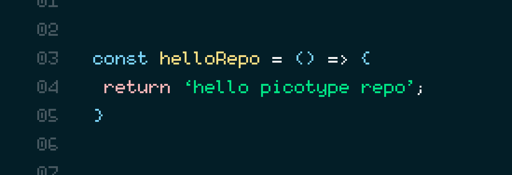

# `pico` fonts

- `picotype` typeface   
  A 8×5 pixel font with minimal legible width and height to not have ambiguities. Very pico.

- `picotypepro` typeface   
  A 10×5 pixel font with a minimal legible width and height to to ensure consistent baseline for better legibility.

All typefaces have a nerd font patched version.

## Installation

### Manual Installation
1. Download the font files from the `/build` directory
2. Install the fonts on your system:
   - **macOS**: Double-click the font files or use Font Book
   - **Linux**: Copy to `~/.local/share/fonts/` and run `fc-cache -f -v`
   - **Windows**: Right-click and select "Install"

## Editing in FontForge

1. Install [FontForge](https://fontforge.org/en-US/downloads/mac/)
2. Open the font in FontForge
3. Element → Font Info...
4. General tab:
  - Fontname: unique font name including the font family and the variant. E.g. Helvetica Regular
  - Font Family: only the font family that needs to be the same on all fonts. E.g. Helvetica
  - Name for Humans: just use same as font family
5. TTF Names tab: 
  - \<New\> → English (US) → Preferred Family → e.g. Helvetica
  - \<New\> → English (US) → Preferred Styles → e.g. Regular
  - if you changed the Fontname, update the UniqueID as well
6. File → Generate Fonts...
  - check validate before saving
  - use TrueType
  - No BitMap Fonts
  - Generate


## Patching to nerd fonts

Install python (`brew install python` on mac)

run `./generate`

This will generate the nerd fonts and put them in the `build/generated/nerd`.

After patching, you'll need to edit it again in the  FontForge.Output the generated to `build/picotypenerd`

Manual patching command:

```
fontforge --script ./patcher/font-patcher --careful --mono --complete ./picotype/picotype-regular.ttf
```

Contributions are welcome! Please feel free to submit a Pull Request.